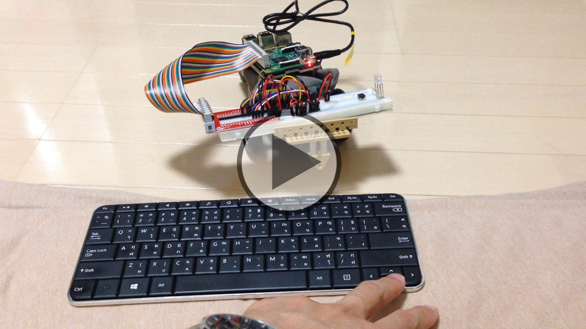
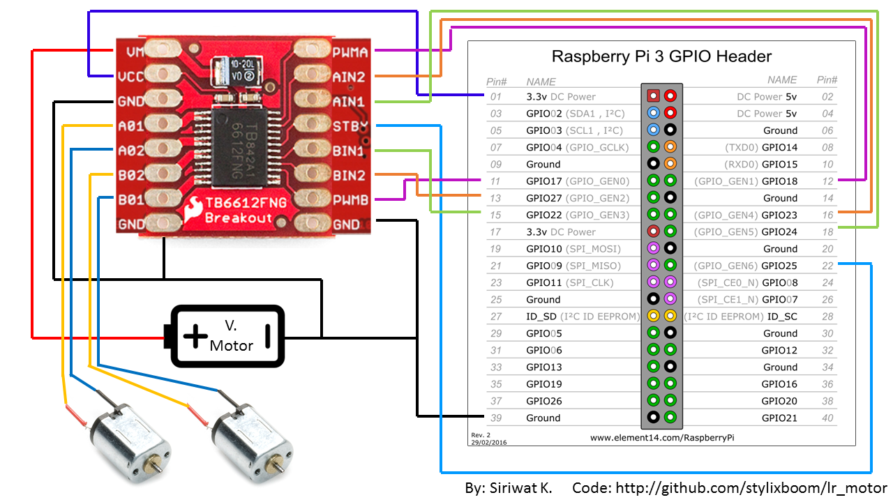
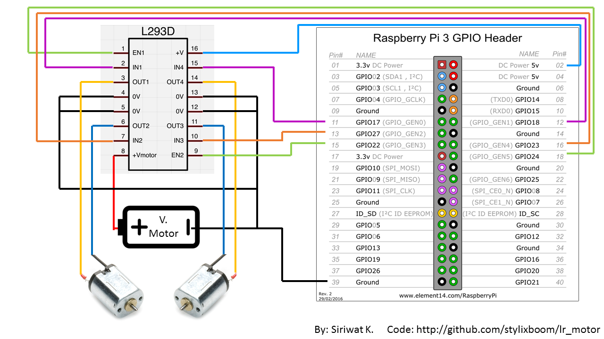

# lr_motor
Left-right motor control with Node.js on a GPIO of the Raspberry Pi.

[](https://youtu.be/_WbnUgH4qKM "LR-Motor control")

This project is to learn how to control dual-motor (left-right) by using Raspberry Pi.
THe code provided here is written in Node.js, which require a package of
- 'pigpio' is to access GPIO port on the Raspberry Pi.
- 'keypress' is to listen to the keyboard input of the Arrow-key (up-down-left-right).

Requirement
- Raspberry Pi
- Motor driver IC
- Installing pigpio Ref: https://www.npmjs.com/package/pigpio

This experiment support two different motor drivers.
- Toshiba - TB6612FNG
- Texas Instruments - L293D

Node:
- TB6612FNG is more efficient, but more expansive (10$), and you will need a solder.
```
TB6612FNG
Ref: http://www.robotshop.com/media/files/PDF/Datasheet%20713.pdf
Truth table
Input                           Output
IN1     IN2     PWM     STBY    OUT1    OUT2    Mode
H       H       H/L     H       L       L       Short brake
L       H       H       H       L       H       CCW
L       H       L       H       L       L       Short brake
H       L       H       H       H       L       CW
H       L       L       H       L       L       Short brake
L       L       H       H       OFF(High ohm)   Stop
H/L     H/L     H/L     L       OFF(High ohm)   Standby
```
- L293D is much cheaper ($0.6) and easier to be used with a breadboard.
```
L293D
Ref: http://www.robotplatform.com/howto/L293/motor_driver_1.html
Truth table
Input                   Function
PWM     IN1     IN2    
H       H       L       Reverse
H       L       H       Forward
H       H       H       Stop
H       L       L       Stop
L       X       X       Stop
```

# Running with TB6612FNG
Wiring diagram for TB6612FNG


## How to run
`$ sudo node app_t.js`

# Running with L293D
Wiring diagram for L293D


## How to run
`$ sudo node app_l.js`

Node: 'sudo' is needed if you are running as a different user, not root.


Author: Siriwat Kasamwattanarote
E-mail: siriwat@live.jp